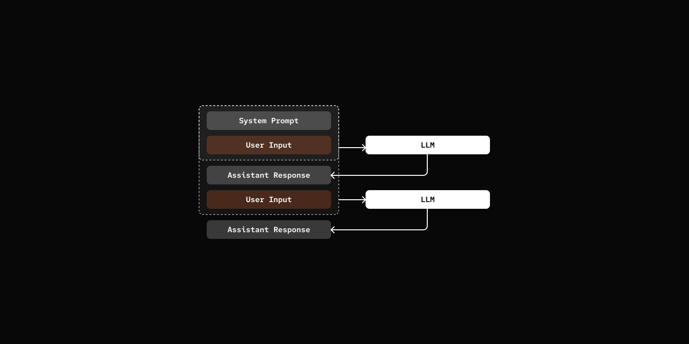

# Step 00: Just a Chat Loop

> All agents start with a simple chat loop.

## Prerequisites

Copy the config file and add your API key:

```bash
cp default_workspace/config.example.yaml default_workspace/config.user.yaml
# Edit config.user.yaml to add your API key
```

## What We will Build?



## Key Components

- **ChatLoop**: Handles user input and displays responses
- **LLM Call**: Sends message history to the LLM provider and get response back.
- **Session**: Manages conversation state and message history, LLM always see the full history.

[src/mybot/cli/chat.py](src/mybot/cli/chat.py)

```python
class ChatLoop:
    async def run(self) -> None:
        self.console.print(
            Panel(
                Text("Welcome to my-bot!", style="bold cyan"),
                title="Chat",
                border_style="cyan",
            )
        )
        self.console.print("Type 'quit' or 'exit' to end the session.\n")

        try:
            while True:
                user_input = await asyncio.to_thread(self.get_user_input)

                if user_input.lower() in ("quit", "exit", "q"):
                    self.console.print("\n[bold yellow]Goodbye![/bold yellow]")
                    break

                if not user_input:
                    continue

                try:
                    response = await self.session.chat(user_input)
                    self.display_agent_response(response)
                except Exception as e:
                    self.console.print(f"\n[bold red]Error:[/bold red] {e}\n")

        except (KeyboardInterrupt, EOFError):
            self.console.print("\n[bold yellow]Goodbye![/bold yellow]")
```

[src/mybot/core/agent.py](src/mybot/core/agent.py)

``` python
class AgentSession:
    async def chat(self, message: str) -> str:
        user_msg: Message = {"role": "user", "content": message}
        self.state.add_message(user_msg)

        messages = self.state.build_messages()
        response = await self.agent.llm.chat(messages)

        assistant_msg: Message = {"role": "assistant", "content": response}
        self.state.add_message(assistant_msg)

        return response
```

[src/mybot/provider/llm/base.py](src/mybot/provider/llm/base.py)

``` python 
class LLMProvider:
    async def chat(
        self,
        messages: list[Message],
        **kwargs: Any,
    ) -> str:        
        request_kwargs: dict[str, Any] = {
            "model": self.model,
            "messages": messages,
            "api_key": self.api_key,
        }

        if self.api_base:
            request_kwargs["api_base"] = self.api_base
        request_kwargs.update(kwargs)

        response = await acompletion(**request_kwargs)
        message = cast(Choices, response.choices[0]).message

        return message.content or ""
```


## Try it out

```bash
cd 00-chat-loop
uv run my-bot chat

# Type 'quit' or 'exit' to end the session.

# You: Hello, who is this?
# pickle: Meow! Hello there! I'm Pickle, your friendly cat assistant. 🐾
# You: I am Zane, Nice to meet you.
# pickle: Nice to meet you, Zane! *purrs happily* 🐱
```

## What's Next

[Step 01: Tools](../01-tools/) - Give your agent the ability to take actions