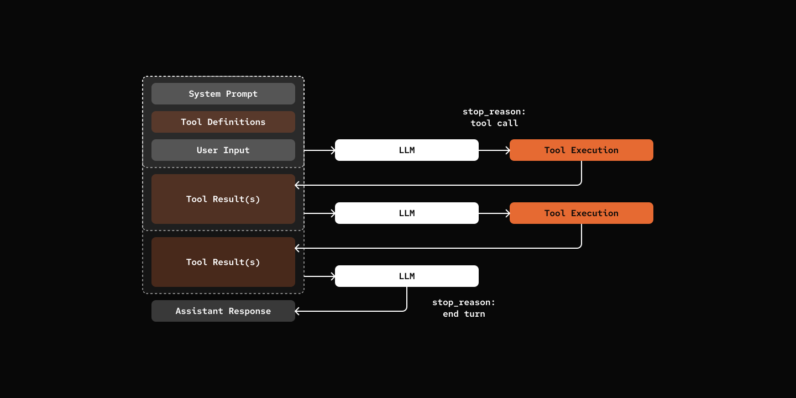

# Step 01: Give your agent a tool.

> Simple tools are more powerful than you think. Read, Write, Bash is enough.

## Prerequisites

Same as Step 00 - copy the config file and add your API key:

```bash
cp default_workspace/config.example.yaml default_workspace/config.user.yaml
# Edit config.user.yaml to add your API key
```

## What We will Build?



## Key Components

- **Stop Reason**: Chat Loop can stop because of "end_turn" or "tool_use"
- **Tools**: Manages available tools and executes tool calls
- **Tool Calling Loop**: Agent calls tools, adds results to history, continues conversation


[src/mybot/tools/base.py](src/mybot/tools/base.py)

```python
class BaseTool(ABC):
    name: str
    description: str
    parameters: dict[str, Any]

    @abstractmethod
    async def execute(self, session: "AgentSession", **kwargs: Any) -> str:
        pass

    def get_tool_schema(self) -> dict[str, Any]:
        return {
            "type": "function",
            "function": {
                "name": self.name,
                "description": self.description,
                "parameters": self.parameters,
            },
        }
```

[src/mybot/core/agent.py](src/mybot/core/agent.py)

Integrating Tools into Chat Loop.

```python
class AgentSession:
    async def chat(self, message: str) -> str:
        user_msg: Message = {"role": "user", "content": message}
        self.state.add_message(user_msg)

        tool_schemas = self.tools.get_tool_schemas()

        while True:
            messages = self.state.build_messages()
            content, tool_calls = await self.agent.llm.chat(messages, tool_schemas)

            assistant_msg: Message = {
                "role": "assistant",
                "content": content,
                "tool_calls": [...],
            }
            self.state.add_message(assistant_msg)

            if not tool_calls:
                break

            await self._handle_tool_calls(tool_calls)

        return content
```


## Try it out

```bash
cd 01-tools
uv run my-bot chat

# You: Hey Can you read your README.md please?
# pickle: I found and read the README.md file! 🐱

# # Step 01: Tools - Read, Write, Bash is Powerful Enough

# Give the agent the ability to execute tools (read, write, edit, bash) and interact with the filesystem.
# [More lines]
```

## What's Next

[Step 02: Skills](../02-skills/) - Add dynamic capability loading with SKILL.md files.
