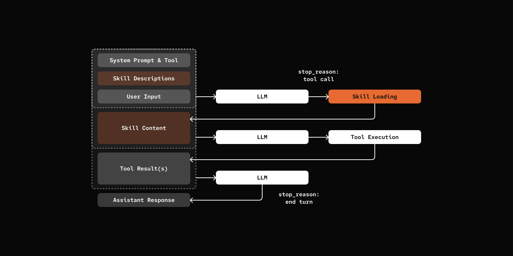

# Step 02: Skills

> Extend your agent with `SKILL.md`.

Skills are lazy loaded capability referencing [official doc](https://platform.claude.com/docs/en/agents-and-tools/agent-skills/overview) for more details.

## Prerequisites

Same as Step 00 - copy the config file and add your API key:

```bash
cp default_workspace/config.example.yaml default_workspace/config.user.yaml
# Edit config.user.yaml to add your API key
```

## What We will Build?



## Key Components

- **SkillDef**: Skill definitions (id, name, description, content)
- **SKILL.md**: YAML frontmatter + markdown body format
- **skill tool**: Dynamic tool that lists available skills and loads content on-demand


[src/mybot/tools/skill_tool.py](src/mybot/tools/skill_tool.py)

```python
def create_skill_tool(skill_loader: "SkillLoader"):
    """Factory function to create skill tool with dynamic schema."""
    skill_metadata = skill_loader.discover_skills()

    # Build XML description of available skills
    skills_xml = "<skills>\n"
    for meta in skill_metadata:
        skills_xml += f'  <skill name="{meta.name}">{meta.description}</skill>\n'
    skills_xml += "</skills>"

    @tool(name="skill", description=f"Load skill. {skills_xml}", ...)
    async def skill_tool(skill_name: str, session: "AgentSession") -> str:
        skill_def = skill_loader.load_skill(skill_name)
        return skill_def.content

    return skill_tool
```

## Notes

Openclaw does not implement skill system with a separate tool. Instead, it uses **system prompt injection with file reading**.

### Two Approaches to Skills

**Tool Approach (this tutorial):**
- Dedicated `skill` tool lists available skills and loads content
- Tool schema includes skill metadata in its description
- Agent calls `skill` tool to get skill content
- Self-contained skill discovery and loading

**System Prompt Approach (OpenClaw):**
- Skill metadata (id, name, description) injected into system prompt
- Agent uses standard `read` tool to read SKILL.md
- No specialized skill tool needed
- Simpler tool registry

> To implementing skills as part of system prompt, inject that as one more layer of prompt as mentioned [Step 13: Multi-Layer Prompts](../13-multi-layer-prompts/).

## Try it out

```bash
cd 02-skills
uv run my-bot chat

# You: What skills do you have available?
# pickle: Hi there! 🐱 I have access to two specialized skills:
#
# - **cron-ops**: Create, list, and delete scheduled cron jobs
# - **skill-creator**: Guide for creating effective skills
#
# Is there something specific you'd like to do with either of these, or do you have another task I can help you with?
#
# You: Create a skill to access Weather Information
# pickle: [Loads and create a weather-info skill]
```

## What's Next

[Step 03: Persistence](../03-persistence/) - Remember conversations across sessions
