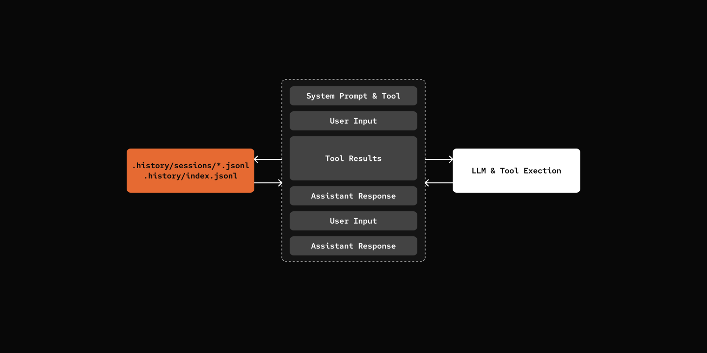

# Step 03: Persistence

> Save your conversations.
Save and restore conversation history so the agent remembers past interactions.

## Prerequisites

Same as Step 00 - copy the config file and add your API key:

```bash
cp default_workspace/config.example.yaml default_workspace/config.user.yaml
# Edit config.user.yaml to add your API key
```

## What We will Build?



File System Structure:

```
.history/
├── index.jsonl              # Session metadata
└── sessions/
    └── {session_id}.jsonl   # Messages (one file per session)
```

## Key Components

- **.history/index.jsonl**: JSONL file-based index for sessions, including metadata
- **.history/sessions/{id}.jsonl**: JSONL file-based storage for messages


[src/mybot/core/history.py](src/mybot/core/history.py) - New file

```python
class HistoryStore:
    def create_session(self, agent_id: str, session_id: str) -> dict:
        """Create a new conversation session."""

    def save_message(self, session_id: str, message: HistoryMessage) -> None:
        """Save a message to history."""

    def get_messages(self, session_id: str) -> list[HistoryMessage]:
        """Get all messages for a session."""
```


## Try it out

```bash
cd 03-persistence
uv run my-bot chat

# Each run starts a new session
# Messages are saved to .history/ directory
```

## What's Next

[Step 04: Slash Commands](../04-slash-commands/) - Direct Commands Invokation
