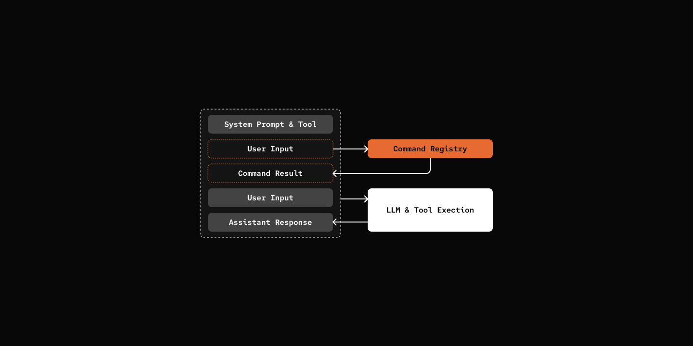

# Step 04: Slash Commands

> Direct user control over sessions.

## Prerequisites

Same as Step 00 - copy the config file and add your API key:

```bash
cp default_workspace/config.example.yaml default_workspace/config.user.yaml
# Edit config.user.yaml to add your API key
```

## What We will Build?

### Architecture



## Key Components

- **Command**: Base class for slash commands (async execute method)
- **CommandRegistry**: Registers and dispatches commands
- **Commands**: `/help`, `/skills`, `/session`


[src/mybot/core/commands/base.py](src/mybot/core/commands/base.py) - New file

```python
class Command(ABC):
    """Base class for slash commands."""

    name: str
    aliases: list[str] = []
    description: str = ""

    @abstractmethod
    async def execute(self, args: str, session: "AgentSession") -> str:
        """Execute the command and return response string."""
        pass
```

[src/mybot/core/commands/registry.py](src/mybot/core/commands/registry.py) - New file

```python
class CommandRegistry:
    def register(self, cmd: Command) -> None:
        """Register a command and its aliases."""

    async def dispatch(self, input: str, session: "AgentSession") -> str | None:
        """Parse and execute a slash command. Returns None if not a command."""
```

[src/mybot/cli/chat.py](src/mybot/cli/chat.py) - Add command dispatch

```python
 async def run(self) -> None:
        # ... Say Hello
        while True:
            # ... Get user input

            # Check for slash commands
            cmd_response = await self.session.command_registry.dispatch(
                user_input, self.session
            )
            if cmd_response is not None:
                self.console.print(cmd_response)
                continue

            # Normal chat
            response = await self.session.chat(user_input)
            self.display_agent_response(response)

```

## Notes

Slash commands may or may not be added to the session history (message log sent to the LLM). This is a design decision — commands are user controls, not conversation content. Either approach is valid. The choice depends on your use case.

## Try it out

```bash
cd 04-slash-commands
uv run my-bot chat

# Try the commands:
# You: /help
# **Available Commands:**
# /help, /? - Show available commands
# /skills - List all skills or show skill details
# /session - Show current session details

# You: /session
# **Session ID:** `abc123...`
# **Agent:** Pickle (pickle)
# **Created:** 2026-03-08T12:00:00
# **Messages:** 0
```

## What's Next

[Step 05: Compaction](../05-compaction/) - Keep Talking...
