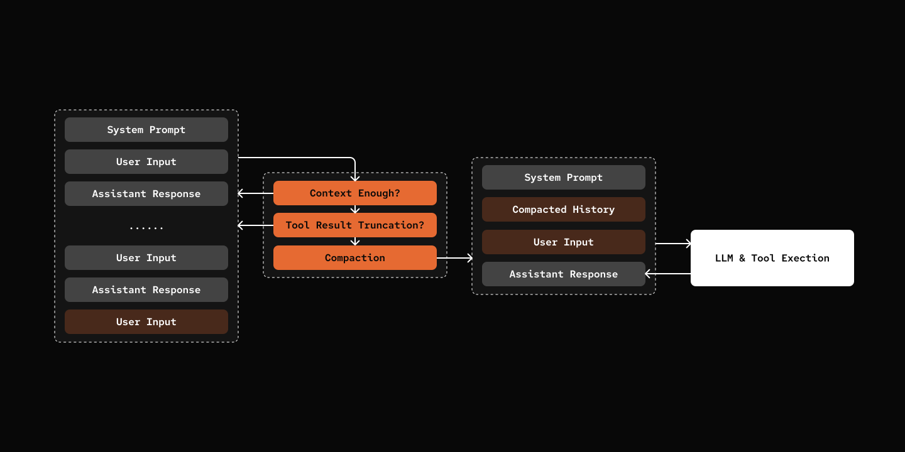

# Step 05: Compaction

> Pack you history and carry on...

## Prerequisites

Same as Step 00 - copy the config file and add your API key:

```bash
cp default_workspace/config.example.yaml default_workspace/config.user.yaml
# Edit config.user.yaml to add your API key
```

## What We will Build?



- Context over threshold?
- Truncate oversized tool result.
- Still oversize?
- Summarize old messages.
- Rolling over to new session.


## Key Components

- **Token Estimation**: Uses litellm's token_counter for accurate estimates
- **Truncation Strategy**: First truncates large tool results, then summarizes old messages
- **Context Compaction**: Summarize old messages, and use that as the first few prompts of a new session.
- **Commands**: `/compact` (manual), `/context` (show usage)


[src/mybot/core/context_guard.py](src/mybot/core/context_guard.py) - New file

```python
@dataclass
class ContextGuard:
    token_threshold: int = 160000  # 80% of 200k context

    def estimate_tokens(self, state: SessionState) -> int:
        return token_counter(model=state.agent.agent_def.llm.model, messages=state.build_messages())

    async def check_and_compact(self, state: SessionState) -> SessionState:
        token_count = 

        if self.estimate_tokens(state) < self.token_threshold:
            return state

        state.messages = self._truncate_large_tool_results(state.messages)

        if self.estimate_tokens(state) < self.token_threshold:
            return state

        return await self._compact_messages(state)
```

[src/mybot/core/agent.py](src/mybot/core/agent.py) - Integration

```python
async def chat(self, message: str) -> str:
    # ... add user message ...

    while True:
        messages = self.state.build_messages()
        # Check and compact before LLM call
        self.state = await self.context_guard.check_and_compact(self.state)
        content, tool_calls = await self.agent.llm.chat(messages, tool_schemas)
```

## Try it out

```bash
cd 05-compaction
uv run my-bot chat

# Check context usage anytime:
# You: /context
# **Messages:** 12
# **Tokens:** 15,420 (9.6% of 160,000 threshold)

# You: /compact
# ✓ Context compacted. 8 messages retained.
```

## What's Next

[Step 06: Web Tools](../06-web-tools/) - Add web search and URL reading capabilities
