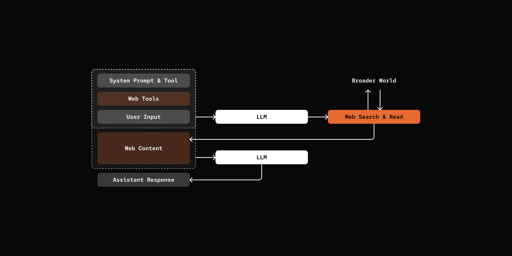

# Step 06: Web Tools

> Your Agent want to see the bigger world.
> At the root, they are just two new tools.

## Prerequisites

```bash
cp default_workspace/config.example.yaml default_workspace/config.user.yaml
# Edit config.user.yaml to add your API key
# Uncommend websearch and webread sections
# Add your websearch api key
```

## What We Will Build



## Key Components

- **WebSearchProvider**: Web search providers.
- **WebReadProvider**: Web reading providers.
- **Tools**: `websearch` and `webread` tools.


[src/mybot/provider/web_search/](src/mybot/provider/web_search/)

```python
class WebSearchProvider(ABC):
    async def search(self, query: str) -> list[SearchResult]: ...
```

[src/mybot/provider/web_read/](src/mybot/provider/web_read/)

```python
class WebReadProvider(ABC):
    async def read(self, url: str) -> ReadResult: ...
```

[src/mybot/tools/websearch_tool.py](src/mybot/tools/websearch_tool.py)

```python
@tool(...)
async def websearch(query: str, session: "AgentSession") -> str:
    results = await provider.search(query)

    if not results:
        return "No results found."
    output = []
    for i, r in enumerate(results, 1):
        output.append(f"{i}. **{r.title}**\n   {r.url}\n   {r.snippet}")
    return "\n\n".join(output)
```

[src/mybot/tools/webread_tool.py](src/mybot/tools/webread_tool.py)

```python
@tool(...)
async def webread(url: str, session: "AgentSession") -> str:
    result = await provider.read(url)
    if result.error:
        return f"Error reading {url}: {result.error}"

    return f"**{result.title}**\n\n{result.content}"
```

## Try it out

```bash
cd 06-web-tools
uv run my-bot chat

# You: What is pickle bot? search online please.
# pickle: Based on my search, there are actually a few different things called "Pickle Bot":

# ### 1. **Pickle Robot Company** 🤖
# ### 2. **Pickle Bot (Discord Bot)** 💬
# ### 3. **pickle-bot (GitHub)** 🐱
# An open-source project described as:
# - "Your own AI assistant, speak like a cat"
# - "Pickle is a standard little cat"
# - A customizable AI assistant that you can name, talk to, and teach

# The GitHub version sounds like it could be related to me - a cat-speaking AI assistant! 😺

# Which one were you curious about?
```

## What's Next

[Step 07: Event-Driven](../07-event-driven/) - The great refactor to event-based architecture
