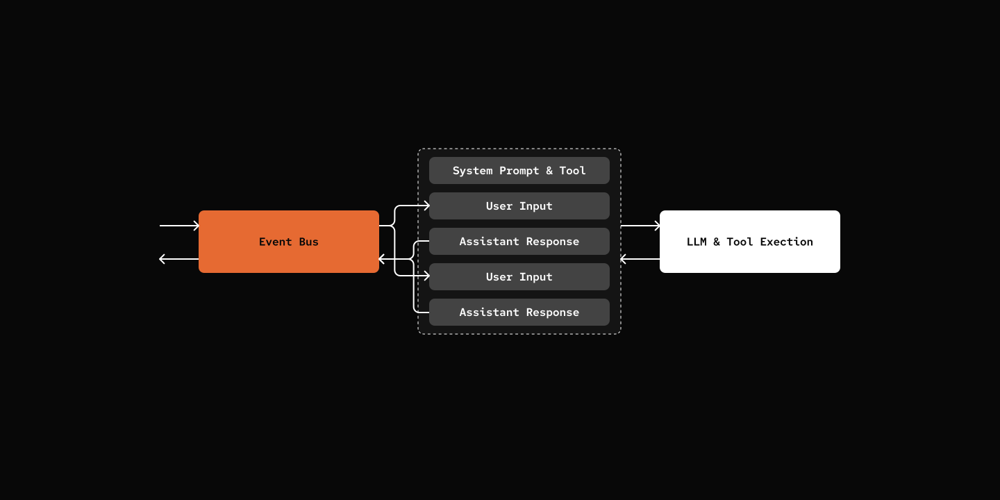

# Step 07: Event-Driven Architecture

> Expose you agent beyond CLI.

## Prerequisites

Same as Step 06 - copy the config file and add your API key:

```bash
cp default_workspace/config.example.yaml default_workspace/config.user.yaml
# Edit config.user.yaml to add your API keys
```

## What We Will Build



## Key Components

- **EventBus** - Central pub/sub for event distribution
- **Events** - InboundEvent, OutboundEvent
- **Workers** - Background tasks that process events
- **AgentWorker** - Handles InboundEvent → executes agent session → emits OutboundEvent


[src/mybot/core/events.py](src/mybot/core/events.py)

```python
@dataclass
class InboundEvent(Event):
    session_id: str
    content: str
    retry_count: int = 0

@dataclass
class OutboundEvent(Event):
    session_id: str
    content: str
    error: str | None = None
```

[src/mybot/core/eventbus.py](src/mybot/core/eventbus.py)

```python
class EventBus(Worker):
    def subscribe(
        self, event_class: type[E], handler: Callable[[E], Awaitable[None]]
    ) -> None:
        """Subscribe a handler to an event class."""
        self._queue: asyncio.Queue[Event] = asyncio.Queue()

    def unsubscribe(self, handler: Handler) -> None:
        """Remove a handler from all subscriptions."""
        
    async def publish(self, event: Event) -> None:
        """Publish an event to the internal queue (non-blocking)."""
        await self._queue.put(event)

    async def run(self) -> None:
        """Process events from queue, starting with recovery."""
        logger.info("EventBus started")

        try:
            while True:
                event = await self._queue.get()
                try:
                    await self._dispatch(event)
                except Exception as e:
                    logger.error(f"Error dispatching event: {e}")
                finally:
                    self._queue.task_done()
        except asyncio.CancelledError:
            logger.info("EventBus stopping...")
            raise
```

[src/mybot/server/agent_worker.py](src/mybot/server/agent_worker.py)

```python
class AgentWorker(SubscriberWorker):
    def __init__(self, context):
        self.context.eventbus.subscribe(InboundEvent, self.dispatch_event)

    async def dispatch_event(self, event: InboundEvent):
        agent = Agent(agent_def, self.context)
        session = agent.resume_session(event.session_id)
        response = await session.chat(event.content)

        result = OutboundEvent(
            session_id=event.session_id,
            content=response,
        )
        await self.context.eventbus.publish(result)
```

## Try it out

Actually nothing should be different from previous step...

Impatient reader can skip to [Step 09: Channels](../09-channels/).

## What's Next

[Step 08: Config Hot Reload](../08-config-hot-reload/) - Config Merging and Config Hot Reload
