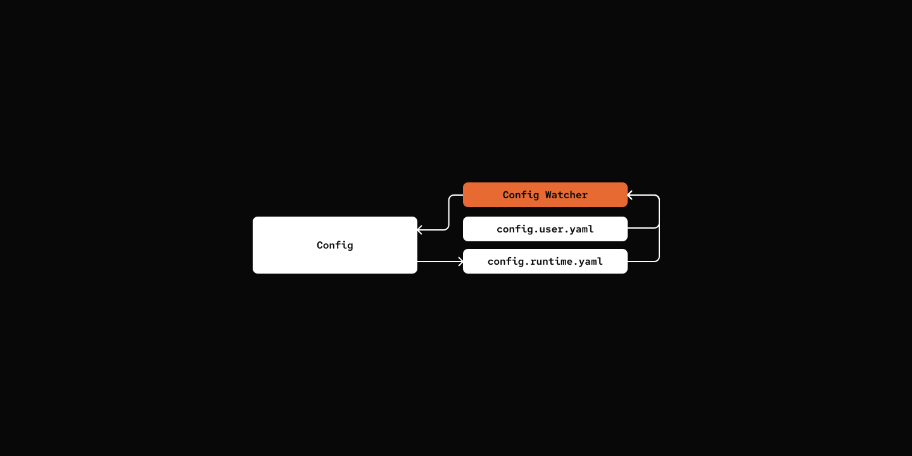

# Step 08: Config Hot Reload

> Reload configuration without restarting the agent.

## Prerequisites

Same as Step 06 - copy the config file and add your API key:

```bash
cp default_workspace/config.example.yaml default_workspace/config.user.yaml
# Edit config.user.yaml to add your API keys
```

## What We Will Build




## Key Components

- **ConfigReloader** - Watches workspace for config file changes using watchdog
- **Config Merging** - Runtime config overrides user config via deep merge


[src/mybot/utils/config.py](src/mybot/utils/config.py)

```python
class Config(BaseModel):
    """Configuration with hot reload support."""

    @classmethod
    def _load_merged_configs(cls, workspace_dir: Path) -> dict[str, Any]:
        config_data: dict[str, Any] = {}

        user_config = workspace_dir / "config.user.yaml"
        runtime_config = workspace_dir / "config.runtime.yaml"

        with open(user_config) as f:
            config_data = cls._deep_merge(config_data, yaml.safe_load(f) or {})

        with open(runtime_config) as f:
            config_data = cls._deep_merge(config_data, yaml.safe_load(f) or {})

        return config_data

    def reload(self) -> bool:
        config_data = self._load_merged_configs(self.workspace)
        new_config = Config.model_validate(config_data)

        for field_name in Config.model_fields:
            setattr(self, field_name, getattr(new_config, field_name))

        return True


class ConfigHandler(FileSystemEventHandler):
    """Handles config file modification events."""

    def __init__(self, config: Config):
        self._config = config

    def on_modified(self, event):
        """Reload config when config.user.yaml changes."""
        if not event.is_directory and event.src_path.endswith("config.user.yaml"):
            self._config.reload()
```

## Try it out

Actually nothing should be different from previous step...

Impatient reader can skip to [Step 09: Channels](../09-channels/).

## What's Next

[Step 09: Channels](../09-channels/)  - multi-platform support for CLI, Telegram, and other interfaces.
