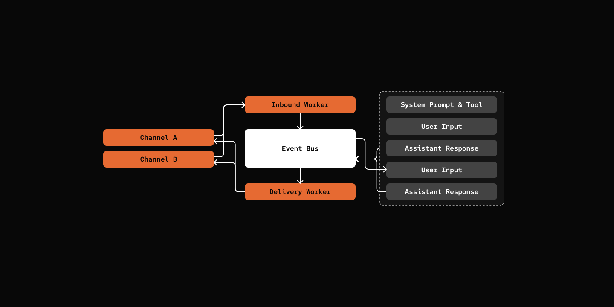

# Step 09: Channels

> Talk to your agent from on your phone.

## Prerequisites

```bash
cp default_workspace/config.example.yaml default_workspace/config.user.yaml
# Edit config.user.yaml to add your API keys
# config Telegram Bot Token
```
## What We Will Build



- User sends message via platform (Telegram, Discord)
- Channel receives message and creates EventSource
- ChannelWorker publishes InboundEvent to EventBus
- AgentWorker processes event and generates response
- AgentWorker publishes OutboundEvent to EventBus
- DeliveryWorker receives OutboundEvent
- DeliveryWorker looks up session's source and sends via appropriate channel

## Key Components

- **EventSource** - Abstract base for platform-specific event sources (CLI, Telegram, Discord)
- **Channel** - Abstract base for messaging platforms with run/reply/stop interface
- **ChannelWorker** - Manages multiple channels and publishes InboundEvents
- **DeliveryWorker** - Subscribes to OutboundEvents and delivers via appropriate channel
- **Event Persistence** - Outbound Event Persistence and failure recovery preventing message lose.


[src/mybot/channel/base.py](src/mybot/channel/base.py)

```python
class Channel(ABC, Generic[T]):
    @property
    @abstractmethod
    def platform_name(self) -> str:
        pass

    @abstractmethod
    async def run(self, on_message: Callable[[str, T], Awaitable[None]]) -> None:
        """Run the channel. Blocks until stop() is called."""
        pass

    @abstractmethod
    async def reply(self, content: str, source: T) -> None:
        """Reply to incoming message."""
        pass

    @abstractmethod
    async def stop(self) -> None:
        """Stop listening and cleanup resources."""
        pass
```

[src/mybot/server/channel_worker.py](src/mybot/server/channel_worker.py)

```python
class ChannelWorker(Worker):
    async def run(self) -> None:
        channel_tasks = [
            channel.run(self._create_callback(channel.platform_name))
            for channel in self.channels
        ]
        await asyncio.gather(*channel_tasks)

    def _create_callback(self, platform: str):
        async def callback(message: str, source: EventSource) -> None:
            session_id = self._get_or_create_session_id(source)

            event = InboundEvent(
                session_id=session_id,
                source=source,
                content=message,
            )
            await self.context.eventbus.publish(event)

        return callback

    def _get_or_create_session_id(self, source: EventSource) -> str:
        source_session = self.context.config.sources.get(str(source))
        if source_session:
            return source_session.session_id

        agent_def = self.context.agent_loader.load(self.context.config.default_agent)
        agent = Agent(agent_def, self.context)
        session = agent.new_session(source)

        # Cache the session
        self.context.config.set_runtime(
            f"sources.{source}", SourceSessionConfig(session_id=session.session_id)
        )

        return session.session_id
```

- Each EventSource (e.g., "platform-telegram:123:456") maps to one session
- First message creates session, subsequent messages reuse it
- Session ID cached in config.runtime.yaml

[src/mybot/server/delivery_worker.py](src/mybot/server/delivery_worker.py)

```python
class DeliveryWorker(SubscriberWorker):
    """Delivers outbound messages to platforms."""

    async def handle_event(self, event: OutboundEvent) -> None:
        """Handle an outbound message event."""
        session_info = self._get_session_source(event.session_id)
        source = self._get_delivery_source(session_info)

        if source and source.platform_name:
            channel = self._get_channel(source.platform_name)
            if channel:
                await channel.reply(event.content, source)

        self.context.eventbus.ack(event)
```

[src/mybot/core/eventbus.py](src/mybot/core/eventbus.py.py)

``` python
class EventBus(Worker):
    async def run(self) -> None:
        await self._recover()
        while True:
            # ... Dispatching Events

    async def _dispatch(self, event: Event) -> None:
        await self._persist_outbound(event)
        await self._notify_subscribers(event)
    
    async def _recover(self) -> int:
        pending_files = list(self.pending_dir.glob("*.json"))

        for file_path in pending_files:
            with open(file_path, "r", encoding="utf-8") as f:
                data = json.load(f)
            event = deserialize_event(data)
            await self._notify_subscribers(event)

        return len(pending_files)

    def ack(self, event: Event) -> None:
        filename = f"{event.timestamp}_{event.session_id}.json"
        final_path = self.pending_dir / filename
        if final_path.exists():
            final_path.unlink()
```

- **Outbound Event Persistence Flow**:
  - `EventBus.publish()` queues event to internal asyncio queue
  - `EventBus._dispatch()` is called for each event
  - `_persist_outbound()` writes OutboundEvent to disk atomically (tmp file + fsync + rename)
  - `_notify_subscribers()` delivers event to all subscribers (e.g., DeliveryWorker)

- **Failure Recovery Flow**:
  - On EventBus startup, `_recover()` scans pending directory for `.json` files
  - Each pending event is deserialized and re-dispatched to subscribers
  - Only after successful delivery does DeliveryWorker call `eventbus.ack(event)`
  - `ack()` deletes the persisted file, confirming delivery is complete

## Try it out

```bash
cd 09-channels
uv run my-bot server
# Send message from the channel of your choice.
```

## What's Next

[Step 10: WebSocket](../10-websocket/)  - real-time web interface for interacting with agents.
